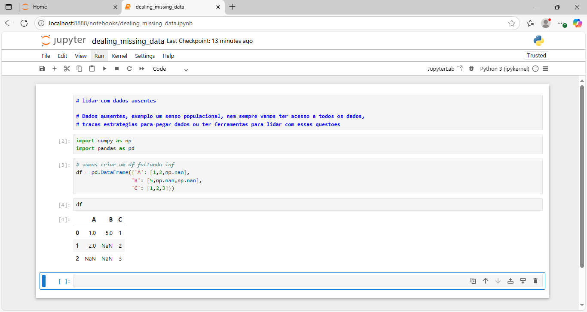
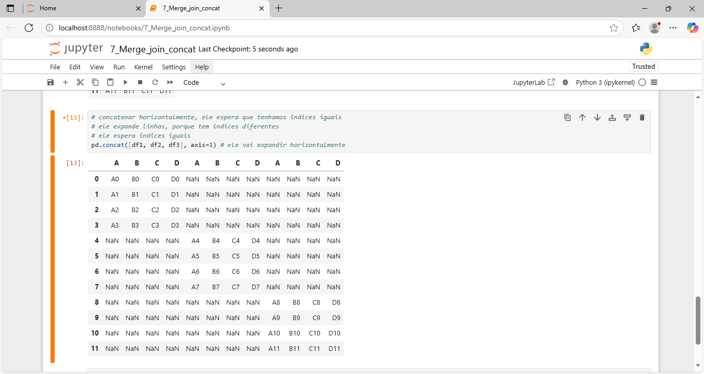
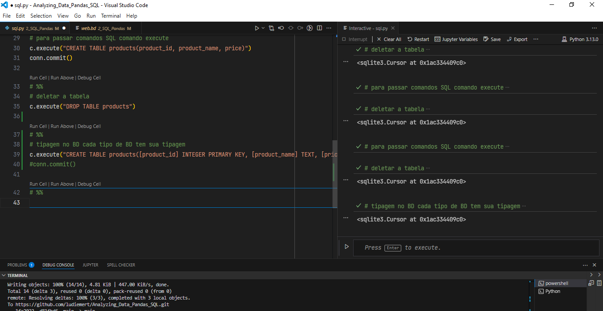
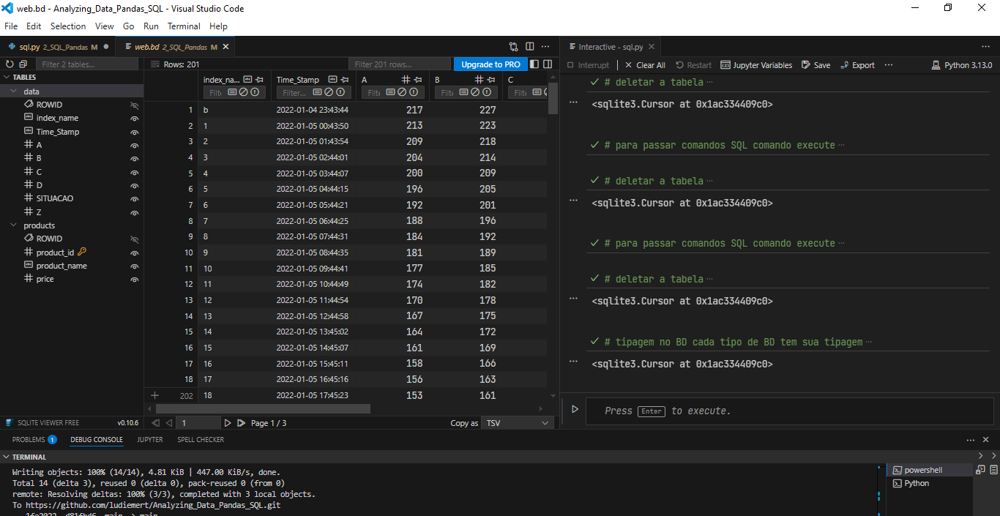
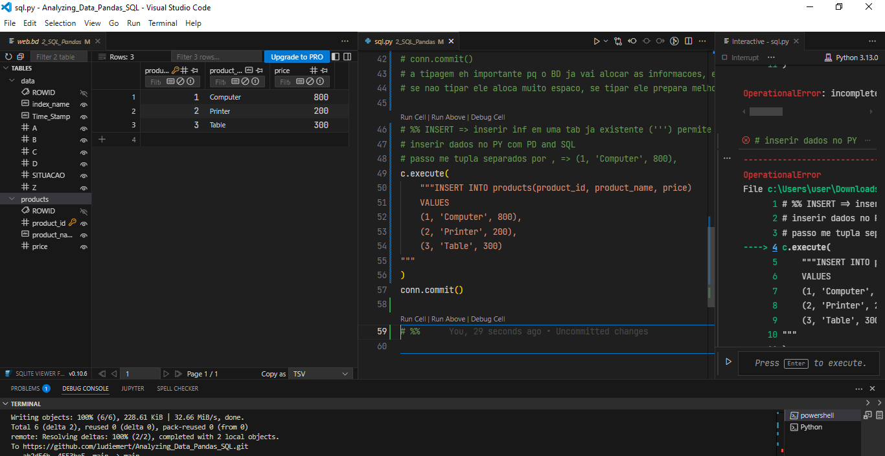
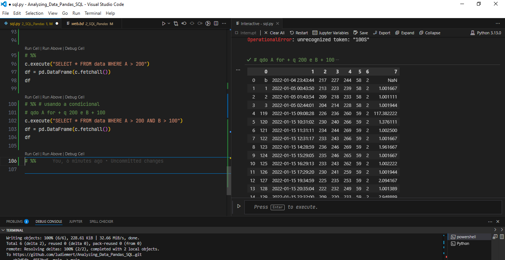
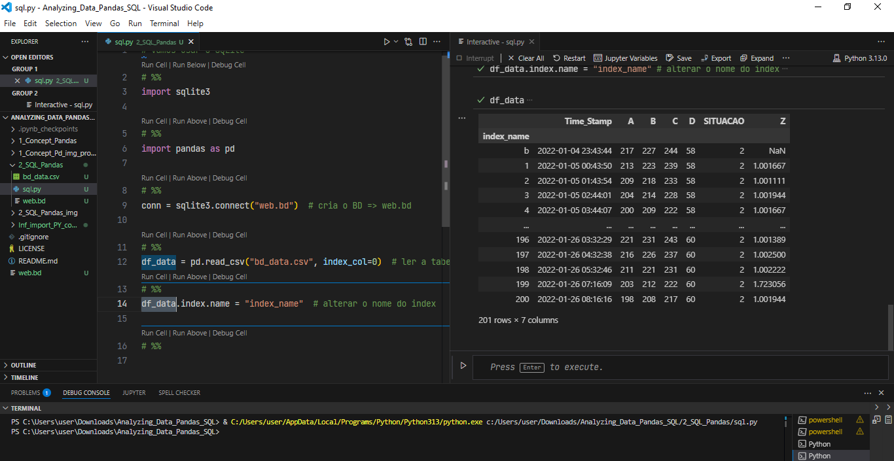
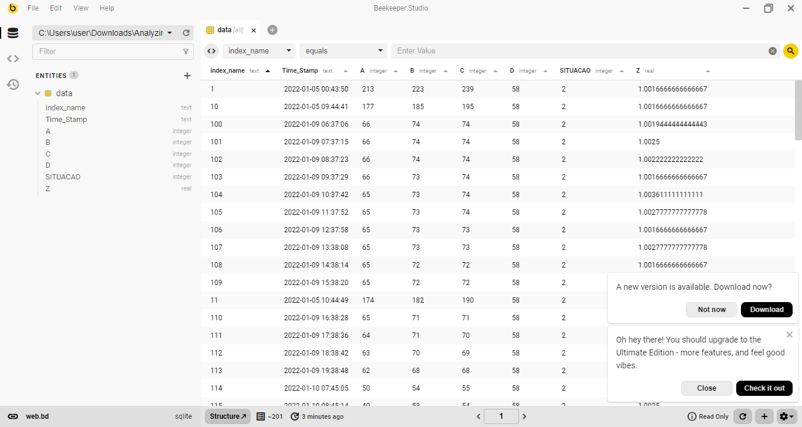

### English 💌

# 🐍 Python -  Analyzing_Data_Pandas_SQL - Asimov Academy

[](https://opensource.org/licenses/MIT)

My projects from the **Analyzing_Data_Pandas_SQL** course at Asimov Academy. I learned programming from beginning to expert level.


Analyzing Data with Pandas &amp; SQL, including creating DataFrames (tables) and Series (columns)


# 📊 Analyzing Data with Pandas & SQL

This repository has my work from the course **Analyzing Data with Pandas & SQL**.

In this course, we use **Pandas**, a Python library to work with data, and **SQL**, a language to use databases.

## 🚀 About the Course

In this course, you will learn:

- What is **Pandas** and how to use it.
- How to create and work with **DataFrames** and **Series** (tables and columns).
- How to select and filter data using `.loc` and `.iloc`.
- How to use simple and multi-level indexes.
- How to use `groupby`, `merge`, `concat`, and `join`.
- How to work with missing data.
- How to create a **SQL** database and use it with Pandas.
- How to use SQL commands: `INSERT`, `SELECT`, `UPDATE`, and `DELETE`.
- How to connect Pandas and SQL to work together.
- How to make **real projects** with data analysis and visualization.

## 👩‍💻 This Course is Good For:

- IT workers who want to learn data analysis.
- People who want to be data analysts or data scientists.
- Business people who use data to make decisions.
- Developers who add data analysis to their apps.
- Researchers using data for school or science projects.

## 🧠 Course Content

| Module | Title |
|--------|-------|
| ✅ 1   | Onboarding |
| ✅ 2   | Course Introduction |
| ✅ 3   | Basic Concepts of Pandas |
| ✅ 4   | Indexes, Filters and GroupBy |
| ✅ 5   | Reading and Combining Tables |
| ✅ 6   | Using SQL Databases with Pandas |
| ✅ 7   | Gasoline Prices in Brazil |
| ✅ 8   | World Obesity Data Analysis |
| ✅ 9   | GDP per Capita Data Analysis |
| ✅ 10  | Final Challenge |

## 📁 Project Structure

```bash
📂 analyze-data-pandas-sql/
├── 📁 notebooks/         # Jupyter notebooks from the course
├── 📁 datasets/          # Data used in the course
├── 📄 README.md          # This file
└── 📄 requirements.txt   # Python packages used


```

🛠️ Technologies

```bash
 - Python
 - Pandas
 - SQL
 - SQLite
 - Jupyter Notebook

```

📌 Notes

- This course is a good way to start learning data analysis with Python.
 - You will learn tools that many companies use today.

💡 Tip: To run the notebooks, install the packages with:
```bash
pip install -r requirements.txt
```


--------

### img projects:

## Screenshots

Here are some images showing the layout of the application:

________________________________________

<h4 align="center">Analyzing_Data_Pandas_SQL 🥰 🚀</h4>

<div align="center">
    <table>
        <tr>
            <td style="width: 50%; text-align: center;">
                
                <p style="margin-top: 5px;">Dealing_missing_data</p>
            </td>
            <td style="width: 50%; text-align: center;">
                
                <p style="margin-top: 5px;">Method_concat_axis</p>
            </td>
        </tr>
    </table>
</div>

  <br/>
  <br/>


________________________________________

<div align="center">
    <table>
        <tr>
             <td style="width: 50%; text-align: center;">
                
                <p style="margin-top: 5px;">Codig_Type_BD</p>
            </td>
            <td style="width: 50%; text-align: center;">
                
                <p style="margin-top: 5px;">Table_Type</p>
            </td>
        </tr>
    </table>
</div>

  <br/>
  <br/>


  ________________________________________

  
<h4 align="center">Analyzing_Data_Pandas_SQL 🥰 🚀</h4>

<div align="center">
    <table>
        <tr>
            <td style="width: 50%; text-align: center;">
                
                <p style="margin-top: 5px;">Insert_date_Table</p>
            </td>
            <td style="width: 50%; text-align: center;">
                
                <p style="margin-top: 5px;">Filter_conditional_AND</p>
            </td>
        </tr>
    </table>
</div>

  <br/>
  <br/>


________________________________________

<div align="center">
    <table>
        <tr>
             <td style="width: 50%; text-align: center;">
                
                <p style="margin-top: 5px;">Alter_name_index_name</p>
            </td>
            <td style="width: 50%; text-align: center;">
                
                <p style="margin-top: 5px;">BD_SQlite_memorry_disck_Rigd</p>
            </td>
        </tr>
    </table>
</div>

  <br/>
  <br/>


  ________________________________________

<h4 align="center">Analyzing_Data_Pandas_SQL 🥰 🚀</h4>

<div align="center">
    <table>
        <tr>
            <td style="width: 50%; text-align: center;">
                
                <p style="margin-top: 5px;">grafico_03_Evolução media por regiao</p>
            </td>
            <td style="width: 50%; text-align: center;">
                
                <p style="margin-top: 5px;">GDP_Per_Person_Img/19_matplotlib_grafic_estimativ</p>
            </td>
        </tr>
    </table>
</div>

  <br/>
  <br/>


________________________________________

<div align="center">
    <table>
        <tr>
             <td style="width: 50%; text-align: center;">
                
                <p style="margin-top: 5px;">Year_project_new</p>
            </td>
            <td style="width: 50%; text-align: center;">
                
                <p style="margin-top: 5px;">img_interative</p>
            </td>
        </tr>
    </table>
</div>

  <br/>
  <br/>


  ----

### Portugues💌

# 🐍 Python -  Analyzing_Data_Pandas_SQL - Asimov Academy

[](https://opensource.org/licenses/MIT)

Repositório com projetos desenvolvidos durante o curso **Analyzing_Data_Pandas_SQL** da Asimov Academy, onde aprendi desde fundamentos Analyzing_Data_Pandas_SQL com Python!!!

# 📊 Analisando Dados com Pandas & SQL

Este repositório contém os projetos e estudos realizados durante o curso **Analisando Dados com Pandas & SQL**. O curso é voltado para quem deseja dominar a biblioteca **Pandas**, amplamente conhecida como o substituto do Excel no mundo Python, e integrar esse conhecimento com **bancos de dados SQL**.

## 🚀 Sobre o Curso

Neste curso, você irá:

- Conhecer a fundo a biblioteca **Pandas**, aprendendo a criar e manipular **DataFrames** e **Series**.
- Utilizar operadores como `.loc` e `.iloc` para selecionar e transformar dados.
- Trabalhar com índices simples e **índices multiníveis**.
- Aplicar métodos poderosos como `groupby`, `merge`, `concat` e `join`.
- Lidar com **valores ausentes** de forma eficiente.
- Criar e manipular um banco de dados **SQL** com comandos como `INSERT`, `SELECT`, `UPDATE` e `DELETE`.
- Realizar a integração entre **Pandas** e **SQL** para análise completa de dados.
- Desenvolver **projetos práticos** com análise e visualização de dados.

## 👩‍💻 Recomendado para

- Profissionais de TI expandindo suas habilidades em análise de dados.
- Aspirantes a analistas e cientistas de dados.
- Profissionais de negócios que tomam decisões baseadas em dados.
- Desenvolvedores que integram análise de dados em aplicações.
- Pesquisadores utilizando ferramentas de dados em projetos acadêmicos.

## 🧠 Conteúdo do Curso

| Módulo | Título |
|--------|--------|
| ✅ 1   | Onboarding |
| ✅ 2   | Apresentação do curso |
| ✅ 3   | Conceitos Básicos de Pandas |
| ✅ 4   | Índices, Filtros e GroupBy |
| ✅ 5   | Lendo e Combinando Tabelas |
| ✅ 6   | Interagindo com Bancos SQL pelo Pandas |
| ✅ 7   | Análise dos Preços da Gasolina no Brasil |
| ✅ 8   | Análise de Dados de Obesidade Mundial |
| ✅ 9   | Análise de Dados de PIB per Capita |
| ✅ 10  | Desafio Final |

## 📁 Estrutura do Repositório

```bash
📂 analise-dados-pandas-sql/
├── 📁 notebooks/            # Notebooks com os exercícios e projetos
├── 📁 datasets/             # Conjuntos de dados utilizados
├── 📄 README.md             # Documentação do repositório
└── 📄 requirements.txt      # Bibliotecas e dependências

```

🛠️ Tecnologias Utilizadas
 - Python
 - Pandas
 - SQL
 - SQLite
 - Jupyter Notebook

📌 Observações
 - Este curso é uma excelente introdução prática ao universo da análise de dados com Python, ideal para quem deseja dominar as ferramentas mais requisitadas do mercado.

💡 Dica: Se você quiser executar os notebooks localmente, instale as dependências usando:
```bash
pip install -r requirements.txt
```


----

Python: Linguagem principal utilizada para desenvolver o app.

________________________________________
### Python: The main programming language used to build the app.

#### 🤝 Contributing
If you would like to contribute to this project, feel free to open an issue or submit a pull request! 🚀
________________________________________
#### 📜 License
This project is licensed under the MIT License - see the LICENSE file for details.
👩💻 Developed with 💙 by [[LuDiemert](https://www.linkedin.com/in/lucianadiemert/)]

________________________________________
- #### My LinkedIn - [](https://www.linkedin.com/in/lucianadiemert/)

________________________________________
## 🌐 **Contact**


#### [**Luciana Diemert**](https://github.com/ludiemert)

🛠 Full-Stack Developer <br>
🖥️ Python | Computer Vision | AI Integrations <br>
📍 T23 R2RV,  Cork - Irland 
☎ +353 87 243 8690

<a href="https://www.linkedin.com/in/lucianadiemert" target="_blank"></a>&nbsp;
<a href="mailto:lucianadiemert@gmail.com" target="_blank"></a>&nbsp;
<a href="#"></a>&nbsp;
<a href="https://www.github.com/ludiemert" target="_blank"></a>&nbsp;

<br clear="left"/>

---
Developed with ❤ by [ludiemert](https://github.com/ludiemert).
